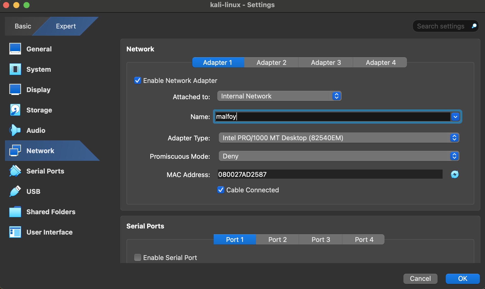
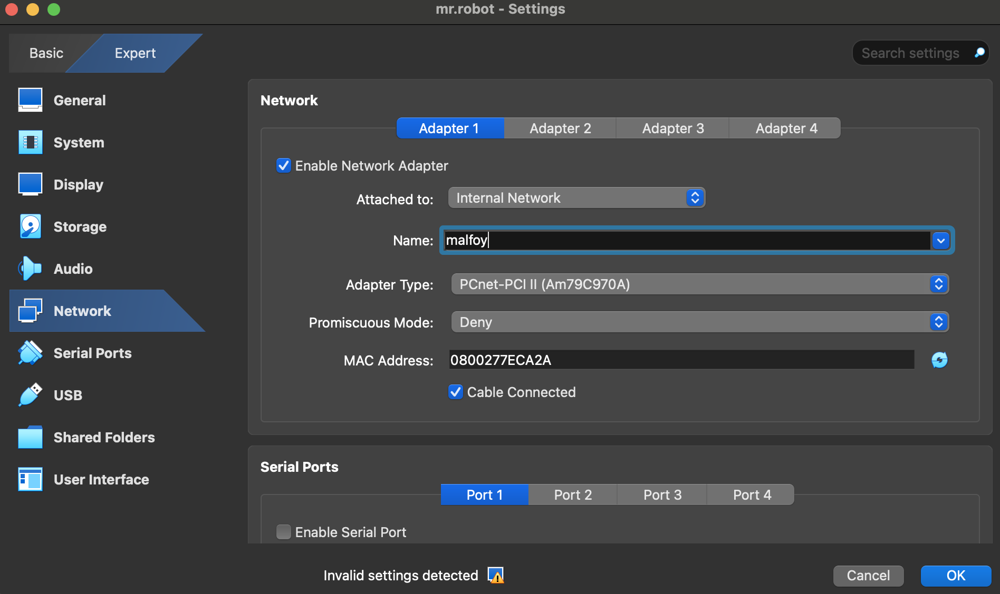
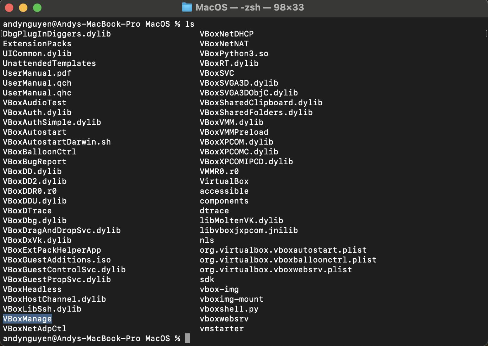
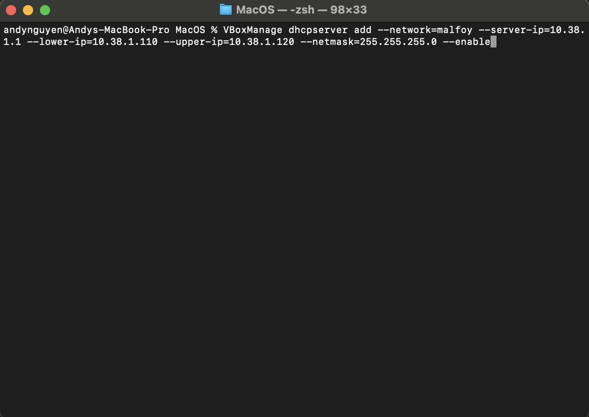
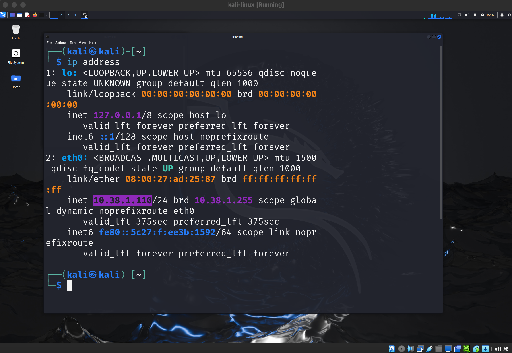
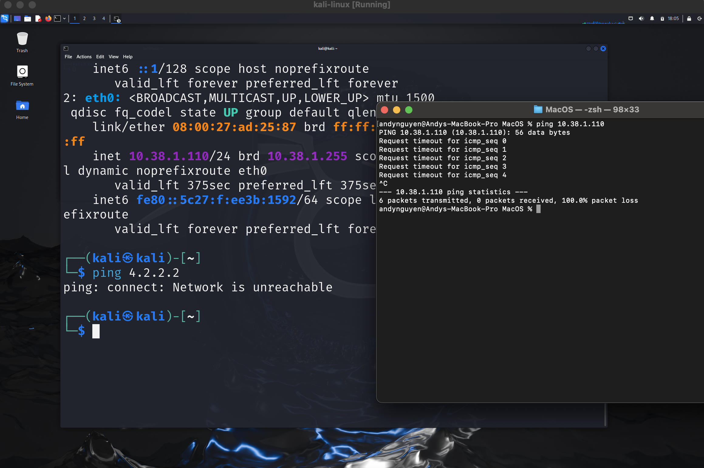
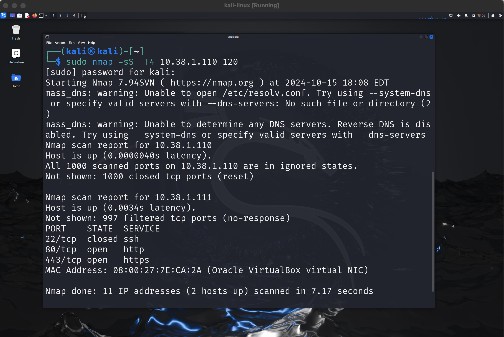
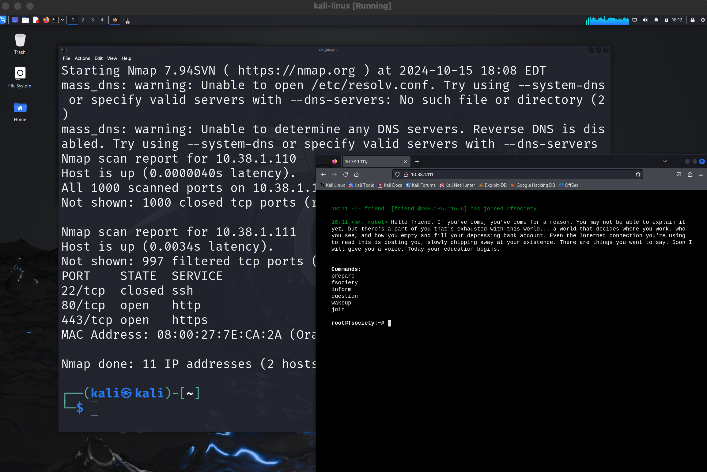

  <h2><b>Mr. Robot's CTF</b></h2>

In this project, I set up a hacking lab using Kali Linux and a vulnerable machine from VulnHub to complete the Mr. Robot's CTF challenge.

<h3><strong>Step 1: Setup</strong></h3>
1. Download and install VirtualBox, the VirtualBox Extension Pack, Kali Linux, and the Mr. Robot VM from VulnHub.
   
2. After importing the OVA files into VirtualBox, I isolated the network by modifying the network settings in VirtualBox. I ensured that both Kali Linux and Mr. Robot are connected to the same internal network.

<h3><strong>Step 2: Configuring DHCP Server</strong></h3>
To enable the isolated network to assign IP addresses, I configured a DHCP server in VirtualBox.

1. I navigated to the directory where VirtualBox is installed.
   
   

2. I used the following `VBoxManage` command to create a DHCP server. The command parameters are as follows:
   - `vboxmanage dhcpserver`: The tool to create a DHCP server.
   - `add`: To add a new DHCP server.
   - `--network`: Specifies the internal network name.
   - `--server-ip`, `--lower-ip`, `--upper-ip`, and `--netmask`: Set up the IP range and configuration.

   

<h3><strong>Step 3: Verify IP Address Assignment</strong></h3>
Next, I opened Kali Linux, logged in using the default credentials, and confirmed that an IP address was successfully assigned by the DHCP server.

<h3><strong>Step 4: Network Isolation Test</strong></h3>
To ensure proper isolation, I verified that the virtual machines (VMs) could not communicate with the host machine and that my host system could not communicate with the isolated network.

<h3><strong>Step 5: Initial Reconnaissance</strong></h3>

sudo nmap -sS -T4 10.38.1.110-120

With the network set up, I started my attack by scanning the Mr. Robot VM. I used the following `nmap` command to perform a SYN scan:
The scan revealed open ports: 22, 80, and 443, indicating that the VM is running a web server.

<h3><strong>Step 6: Web Exploration</strong></h3> After identifying the open ports, I opened Firefox and navigated to the IP address revealed by `nmap`. The web server was running, confirming my initial scan results. 

ONGOING

---

### Key points:
- Step 6 details the web exploration process.
